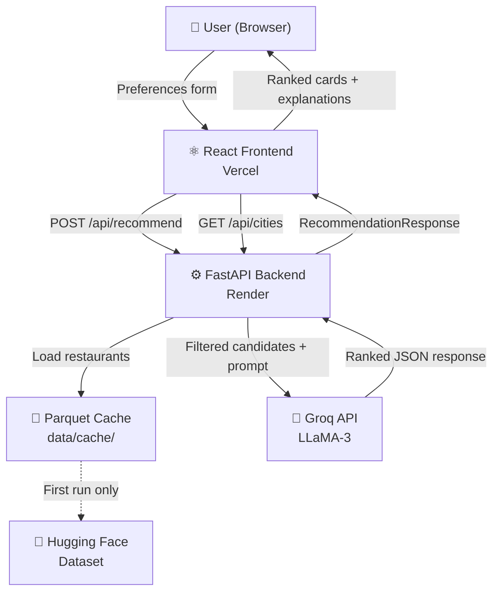
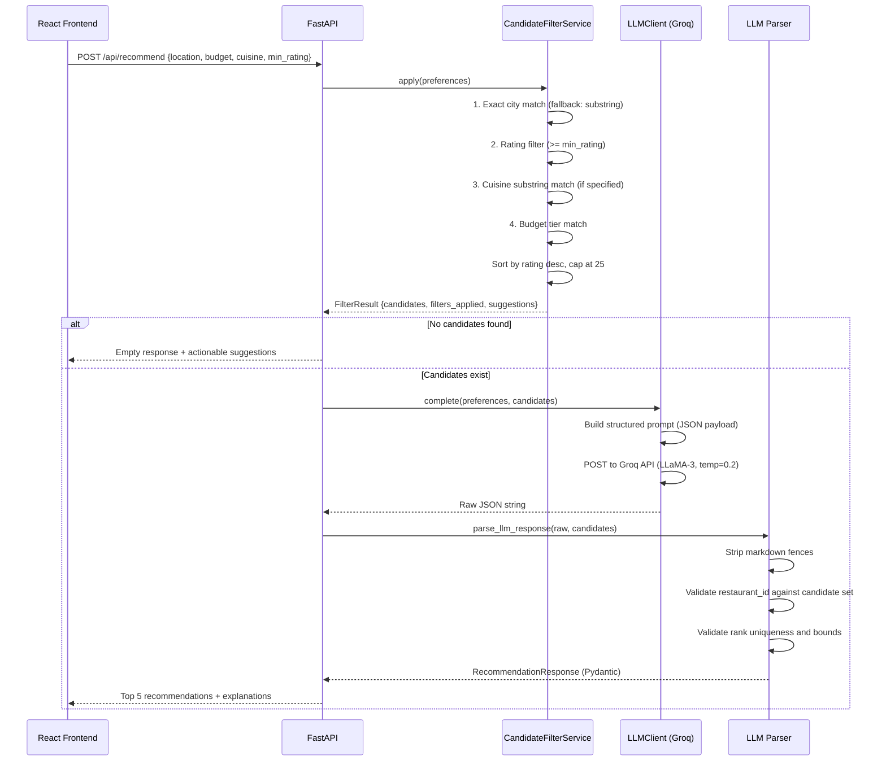

# Zomato AI Restaurant Recommendation System

> **An AI-powered discovery engine that combines structured data filtering with LLM reasoning to deliver personalized restaurant recommendations.**

[](https://python.org)
[](https://fastapi.tiangolo.com)
[](https://react.dev)
[](https://typescriptlang.org)
[](https://groq.com)
[](LICENSE)

| | Link |
|---|---|
| 🌐 **Live Demo** | [zomato-ai-project.vercel.app](https://zomato-ai-project.vercel.app) |
| ⚙️ **Backend API** | [zomato-ai-backend-ua8u.onrender.com](https://zomato-ai-backend-ua8u.onrender.com) |
| 📖 **API Docs** | [/docs](https://zomato-ai-backend-ua8u.onrender.com/docs) |
| 💻 **Repository** | [github.com/ck-anand612/Zomato-AI-Project](https://github.com/ck-anand612/Zomato-AI-Project) |

---

## Project Overview

This is a full-stack AI application that recommends restaurants based on user preferences. It ingests the [Zomato restaurant dataset](https://huggingface.co/datasets/ManikaSaini/zomato-restaurant-recommendation) (~51,000 rows) from Hugging Face, processes and caches it locally, and uses a two-stage pipeline — deterministic filtering followed by LLM reasoning via the Groq API — to return the top 5 ranked restaurants with personalized explanations.

The backend is a Python FastAPI service deployed on Render. The frontend is a React + Vite + Tailwind CSS single-page application deployed on Vercel.

---

## Problem Statement

Finding the right restaurant in a city like Bangalore or Delhi is a surprisingly difficult problem. Traditional search tools force users into rigid filter combinations — cuisine, price range, rating — and return flat lists that still require manual evaluation. They don't understand context, nuance, or intent.

A user who wants *"a quiet North Indian restaurant in Koramangala with good vegetarian options under ₹500 for two"* cannot express that through a standard filter UI. The result is decision fatigue: long lists, no ranking rationale, and no personalization.

---

## Solution Approach

This system solves the problem in two stages:

1. **Hard filtering** — Pandas-based pre-filtering of the 51k+ row dataset using the user's location, budget tier, cuisine, and minimum rating. This is fast, deterministic, and produces a capped candidate pool (max 25 restaurants).

2. **LLM reasoning** — The candidate pool, along with the user's full preferences, is sent to LLaMA-3 via the Groq API. The model ranks the candidates, selects the top 5, and writes a concise explanation for each recommendation in structured JSON.

The result is a ranked, explained shortlist — not a raw list dump.

---

## Why AI?

A standard filter can match restaurants on budget, location, and cuisine. It cannot:

- **Interpret free-text context** (e.g., *"good for a first date"*, *"quick lunch"*)
- **Reason across multiple soft criteria simultaneously** (e.g., balancing rating, ambiance, and cuisine match)
- **Generate a human-readable explanation** for why each restaurant was selected

The LLM does not replace structured filtering — it operates *after* it. Hard constraints (location, budget, minimum rating) are enforced deterministically. The LLM's role is to rank and explain within those constraints, which is precisely where natural language reasoning adds value that a rule engine cannot replicate.

---

## Key Features

### User Features
- **City-aware location selection** — dropdown populated live from the dataset via `/api/cities`
- **Budget tiers** — Low / Medium / High, computed from dataset cost percentiles at ingest time
- **Cuisine filter** — free-text input supporting multiple comma-separated cuisines
- **Minimum rating slider** — adjustable from 0 to 5 in 0.1 increments
- **Ranked recommendations** — top 5 results with AI-written explanations per restaurant
- **Reset functionality** — clears form and recommendation state in one click
- **Graceful degradation** — if the LLM fails or returns invalid JSON, the system falls back to deterministic ranking by rating

### Technical Features
- **Two-stage recommendation pipeline** — filter → LLM → validated structured output
- **Parquet-based data cache** — dataset is preprocessed once and stored as a Parquet file for fast in-memory loading
- **Pydantic validation at every layer** — request validation (`UserPreferences`), LLM response validation (`RecommendationResponse`), domain model validation (`Restaurant`)
- **LLM hallucination guard** — every `restaurant_id` in the LLM response is cross-checked against the candidate list; any invented ID is rejected
- **Structured prompting** — LLM receives candidates as serialized JSON, not free-form text, and is instructed to return a strict schema
- **Auto-retry** — the LLM client retries once on transient failures before escalating to the fallback path
- **CORS-configurable** — origins are controlled via environment variable
- **Auto-generated API documentation** — FastAPI provides interactive Swagger UI at `/docs`

---

## System Architecture



---

## AI Recommendation Workflow



---

## Tech Stack

| Layer | Technology | Purpose |
|---|---|---|
| **Frontend** | React 18, TypeScript | UI component framework |
| **Frontend Build** | Vite 5 | Development server and production bundler |
| **Frontend Styling** | Tailwind CSS 3 | Utility-first CSS styling |
| **HTTP Client** | Axios | API communication from frontend |
| **Backend** | FastAPI 0.111 | Async REST API framework |
| **Server** | Uvicorn | ASGI server for FastAPI |
| **Validation** | Pydantic v2, pydantic-settings | Request/response schema validation and settings management |
| **Data Processing** | Pandas 2.2, PyArrow 14 | Dataset loading, preprocessing, and Parquet I/O |
| **Data Source** | Hugging Face Datasets | Zomato restaurant dataset (~51k rows) |
| **AI Model** | LLaMA-3 (via Groq API) | Restaurant ranking and explanation generation |
| **Frontend Hosting** | Vercel | Static site deployment |
| **Backend Hosting** | Render | Python web service deployment |
| **Containerisation** | Docker | Reproducible backend environment |

---

## Project Structure

```
zomato-ai/
├── app/
│   ├── api.py              # FastAPI application, routes, CORS, repository init
│   ├── main.py             # CLI entrypoint for local testing
│   └── streamlit_app.py    # Streamlit UI (alternative to React frontend)
│
├── core/
│   ├── models.py           # Pydantic domain models (Restaurant, UserPreferences, RecommendationResponse)
│   ├── filter.py           # Two-stage candidate filtering pipeline
│   ├── orchestrator.py     # Pipeline coordinator: filter → LLM → parse → fallback
│   ├── formatter.py        # Output formatting utilities
│   └── validator.py        # Input validation helpers
│
├── data/
│   ├── loader.py           # Hugging Face dataset download + Parquet cache builder
│   ├── preprocessor.py     # Raw dataset normalization (fields, budget tiers, city aliases)
│   ├── repository.py       # In-memory restaurant store with city/filter helpers
│   └── cache/
│       ├── restaurants.parquet     # Pre-built data cache (~1 MB)
│       └── cache_metadata.json     # Ingest stats and budget thresholds
│
├── llm/
│   ├── client.py           # Groq API client with retry logic
│   ├── prompts.py          # Structured prompt builder (system + user messages)
│   └── parser.py           # LLM JSON response parser and fallback generator
│
├── config/
│   └── settings.py         # Pydantic-settings config (env vars, budget tiers, city aliases)
│
├── frontend/
│   ├── src/src/
│   │   ├── App.tsx                     # Root layout (header, form, recommendations)
│   │   ├── api.ts                      # API base URL helper
│   │   └── components/
│   │       ├── Hero.tsx                # Landing hero section
│   │       ├── PreferencesForm.tsx     # User input form (location, budget, cuisine, rating)
│   │       └── Recommendations.tsx     # Recommendation cards display
│   ├── package.json
│   ├── vite.config.ts
│   └── vercel.json
│
├── tests/                  # Unit and integration tests (pytest)
├── docs/                   # Architecture, design, and planning documents
├── scripts/                # CLI demo and dataset exploration scripts
├── Dockerfile
├── docker-compose.yml
├── render.yaml
├── requirements.txt
└── .env.example
```

---

## API Endpoints

| Method | Endpoint | Description | Response |
|---|---|---|---|
| `GET` | `/api/health` | Service health check | `{"status": "ok"}` |
| `GET` | `/api/cities` | Returns all distinct cities available in the dataset | `["Bangalore", "Delhi", ...]` |
| `POST` | `/api/recommend` | Accepts user preferences, returns ranked recommendations | `RecommendationResponse` |
| `GET` | `/docs` | Interactive Swagger UI (auto-generated) | — |

### `POST /api/recommend` — Request Body

```json
{
  "location": "Bangalore",
  "budget": "medium",
  "cuisine": ["Indian", "Chinese"],
  "min_rating": 3.5
}
```

### `POST /api/recommend` — Response

```json
{
  "recommendations": [
    {
      "restaurant_id": "abc123",
      "rank": 1,
      "explanation": "Meghana Foods is one of Bangalore's most celebrated Andhra restaurants..."
    }
  ],
  "summary": "Top picks for Indian cuisine within your budget.",
  "filters_applied": ["location", "min_rating", "cuisine", "budget"],
  "candidates_considered": 18,
  "suggestions": [],
  "fallback_used": false
}
```

---

## Local Installation

### Prerequisites

- Python 3.11+
- Node.js 18+
- A [Groq API key](https://console.groq.com) (free tier available)

### 1. Clone the repository

```bash
git clone https://github.com/ck-anand612/Zomato-AI-Project.git
cd Zomato-AI-Project
```

### 2. Backend setup

```bash
# Create and activate a virtual environment
python -m venv .venv
.venv\Scripts\activate        # Windows
# source .venv/bin/activate   # macOS / Linux

# Install dependencies
pip install -r requirements.txt

# Configure environment variables
cp .env.example .env
# Edit .env and add your GROQ_API_KEY

# Build the local data cache (downloads dataset from Hugging Face)
python -m data.loader --refresh

# Start the API server
uvicorn app.api:app --reload --port 8000
```

The API will be available at `http://localhost:8000`. Interactive docs at `http://localhost:8000/docs`.

### 3. Frontend setup

```bash
cd frontend
npm install
npm run dev
```

The React app will be available at `http://localhost:5173`.

### 4. Run tests

```bash
pytest -q
```

---

## Environment Variables

Copy `.env.example` to `.env` and configure the following:

| Variable | Required | Default | Description |
|---|---|---|---|
| `GROQ_API_KEY` | ✅ Yes | — | API key from [console.groq.com](https://console.groq.com) |
| `LLM_MODEL` | No | `llama3-8b-8192` | Groq model name |
| `LLM_TIMEOUT_SECONDS` | No | `30` | Groq API request timeout |
| `LLM_FALLBACK_ON_ERROR` | No | `true` | Fall back to deterministic ranking if LLM fails |
| `LLM_DISABLED` | No | `false` | Disable LLM entirely (returns filter-only results) |
| `MAX_CANDIDATES` | No | `25` | Maximum restaurants sent to LLM per request |
| `TOP_N_RECOMMENDATIONS` | No | `5` | Number of final recommendations returned |
| `DEFAULT_MIN_RATING` | No | `3.5` | Default minimum rating if not specified |
| `DATASET_NAME` | No | `ManikaSaini/zomato-restaurant-recommendation` | Hugging Face dataset identifier |
| `AUTO_REFRESH_CACHE` | No | `false` | Auto-rebuild cache if Parquet file is missing |
| `CORS_ORIGINS` | No | `*` | Comma-separated list of allowed CORS origins |

---

## Deployment

### Backend — Render

The backend is deployed as a Python web service on Render, configured via `render.yaml`.

**Build command:**
```bash
pip install -r requirements.txt && python -m data.loader --refresh
```

**Start command:**
```bash
uvicorn app.api:app --host 0.0.0.0 --port $PORT
```

The `data.loader --refresh` step runs at build time to pre-populate the Parquet cache. `GROQ_API_KEY` is set as an environment variable in the Render dashboard.

### Frontend — Vercel

The React app is deployed via Vercel. `vercel.json` configures the output directory (`dist`) and routes all requests to `index.html` for client-side routing.

**Build command:**
```bash
npm run build
```

Set `VITE_API_URL` in the Vercel dashboard to point to the Render backend URL.

### Docker (self-hosted)

```bash
docker-compose up --build
```

The `Dockerfile` builds a `python:3.11-slim` image, installs dependencies, runs the data loader, and starts the Streamlit interface on port 8501.

---

## Design Decisions

### Why FastAPI?
FastAPI's async-first architecture and automatic OpenAPI generation were the right fit here. Pydantic is the validation layer throughout the backend — settings, request parsing, domain models, and LLM response parsing — so using a framework that is native to Pydantic eliminated a significant category of glue code. The auto-generated `/docs` endpoint is also useful for anyone exploring the API.

### Why React + Vite?
The frontend has two primary states: the preference form and the recommendation results. React's component model (Hero, PreferencesForm, Recommendations) keeps those concerns cleanly separated. Vite's development server is fast, and its production build outputs a static bundle that Vercel deploys in seconds. Tailwind CSS provides consistent styling without a bespoke CSS file to maintain.

### Why Groq?
Latency is the main constraint for an interactive recommendation UI. Groq's LPU hardware delivers inference speeds that make the end-to-end request — filtering 51k restaurants, building a prompt, calling the model, parsing the response — feel responsive. LLaMA-3 is available on Groq's free tier, which also makes this project accessible to anyone who wants to run it locally.

### Why filter before the LLM?
LLMs have two hard constraints that make raw dataset querying impractical: context window limits and cost. Passing 51,000 restaurant records directly to a model is not feasible. More importantly, hard constraints — "I want a restaurant in Bangalore, not Delhi" — should be enforced deterministically, not left to a model that may occasionally hallucinate. Pre-filtering with Pandas ensures correctness on non-negotiable user requirements and sends the LLM only the candidates it needs to rank.

---

## Challenges & Solutions

| Challenge | Solution |
|---|---|
| **LLM returning hallucinated restaurant IDs** | Every `restaurant_id` in the LLM response is validated against the candidate set. Any unknown ID raises a `ValueError` and triggers the fallback path. |
| **LLM returning JSON wrapped in markdown fences** | The parser strips ` ```json ` and ` ``` ` markers with regex before attempting `json.loads()`. |
| **51k rows too large to filter on every request** | Dataset is downloaded once at ingest time, normalized, and stored as a Parquet file loaded into memory on startup. |
| **Budget tiers varying across cities** | Budget thresholds (low/medium/high) are computed from dataset percentiles at ingest time and stored in `cache_metadata.json`, rather than hardcoded. |
| **City name variations** (e.g., "Bengaluru" vs "Bangalore") | A city alias map in `config/settings.py` normalizes common variants at preprocessing time. |
| **LLM transient failures** | `LLMClient` automatically retries once on failure. If the retry also fails and `LLM_FALLBACK_ON_ERROR=true`, the system falls back to deterministic ranking by rating. |

---

## Limitations

- **Static dataset** — The Zomato data is a fixed Hugging Face snapshot. Ratings, pricing, and availability are not real-time.
- **Groq rate limits** — The free tier has rate limits. Under sustained load, the LLM path may throttle and the fallback ranking will be used.
- **No user accounts** — There is no authentication, saved history, or personalization across sessions.
- **English only** — The prompt and UI are English-only. Non-English cuisine names or location inputs may not match correctly.
- **City coverage** — The dataset covers major Indian cities. Searches for cities not in the dataset return empty results with suggestions.

---

## Future Improvements

- **Semantic search** — Replace Pandas substring matching with a vector database (e.g., Chroma or Qdrant) for semantic cuisine and location matching.
- **Real-time data** — Connect to a live restaurant API to replace the static Hugging Face snapshot with current ratings and pricing.
- **User session history** — Add authentication and allow users to save searches and preferences across sessions.
- **Streaming responses** — Stream the LLM response token-by-token to reduce perceived latency in the UI.
- **Broader city coverage** — Extend the city normalization and alias system to handle a wider range of spellings and regional name variations.

---

## Lessons Learned

**Prompt structure matters more than prompt length.** Providing candidates as serialized JSON rather than prose significantly improved the consistency of the LLM's structured output. The model is much less likely to hallucinate when the input it is reasoning over is already structured.

**LLMs need a deterministic safety net.** Every LLM integration should have a fallback. The validation layer — checking IDs, ranks, and data types — catches subtle failures before they surface as broken UIs.

**Caching is a product decision, not just an engineering one.** Choosing to pre-build the Parquet cache at deploy time rather than on the first request directly affects the experience of the first visitor. That trade-off is worth thinking about explicitly.

**Separation of filtering and reasoning makes both easier to test.** Having `CandidateFilterService` and `LLMClient` as independent, injectable components made the unit test suite straightforward to write and the pipeline easy to reason about.

---

## Author

Built as a portfolio project demonstrating full-stack AI application development.

- **GitHub:** [github.com/ck-anand612](https://github.com/ck-anand612)
- **Repository:** [Zomato-AI-Project](https://github.com/ck-anand612/Zomato-AI-Project)
